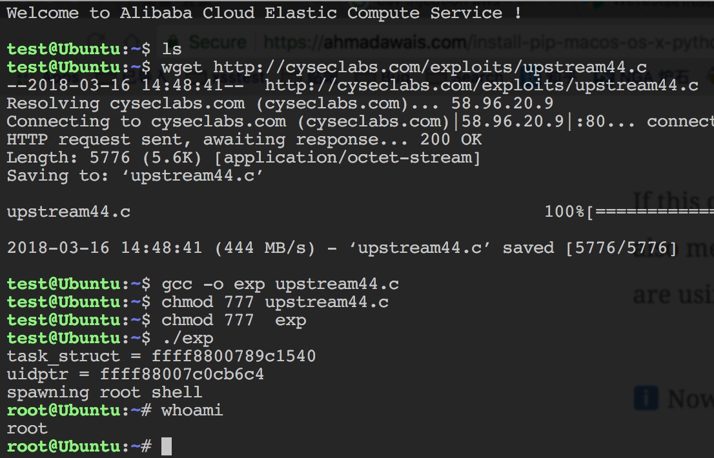
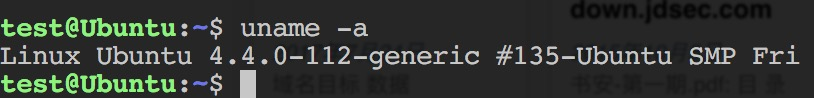

# upstream44提权(CVE-2017-16995)

该漏洞存在于带有 eBPF bpf(2)系统（CONFIG_BPF_SYSCALL）编译支持的Linux内核中，是一个内存任意读写漏洞。该漏洞是由于eBPF验证模块的计算错误产生的。普通用户可以构造特殊的BPF来触发该漏洞，此外恶意攻击者也可以使用该漏洞来进行本地提权操作。

影响版本

Linux Kernel Version 4.14-4.4 （主要影响Debian和Ubuntu发行版，Redhat和CentOS不受影响）

wget http://cyseclabs.com/exploits/upstream44.c

自己调offset

文件：

[upstream44提权](script/upstream44.c)

目前暂未有明确的补丁升级方案。 临时建议用户在评估风险后，通过修改内核参数限制普通用户使用bpf(2)系统调用：

echo 1 > /proc/sys/kernel/unprivileged_bpf_disabled

 

## 资料
https://www.exploit-db.com/exploits/39772/

https://blog.aquasec.com/ebpf-vulnerability-cve-2017-16995-when-the-doorman-becomes-the-backdoor?utmcampaign=General%20website&utmcontent=67375488&utmmedium=social&utmsource=twitter

https://bugs.chromium.org/p/project-zero/issues/detail?id=1454&desc=3

http://cyseclabs.com/exploits/upstream44.c

https://github.com/torvalds/linux/commit/95a762e2c8c942780948091f8f2a4f32fce1ac6f