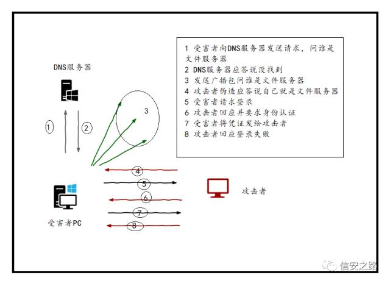

# 基于中间人的LLMNR攻击

## 正常DNS查询流程

1. 文件系统中的hosts文件

配置文件地址：C:\Windows\System32\drivers\etc

2. 查找本地DNS缓存

当上面的步骤无法正确解析时,此时系统会自动去检查本地的dns缓存,按照缓存中的指向再进行解析,执行 ipconfig /displaydns 即可看到缓存内容

3. 向dns服务器发送dns请求

如果连本地缓存也不能正确解析,它会继续向本地网络中的dns服务器去请求

4. 发送LLMNR查询

如果本地网络中的dns也解析失败,它就会被交给LLMNR[链路本地多播名称解析]和netbios-ns去处理解析

5. 发送NetBIOS-NS查询

它工作在OSI模型的会话层。NetBIOS是一个API不是一个windows操作系统之间的协议。计算机的NetBIOS名字跟电脑名字是一样的

## 攻击过程

### 工具

1. https://github.com/SpiderLabs/Responder
2. msf -- https://www.rapid7.com/db/modules/auxiliary/spoof/llmnr/llmnr_response
3. https://github.com/byt3bl33d3r/MITMf

### 简要步骤

1. 监听

responder -i 10.7.7.31

2. 被攻击者访问不存在的域名

\filesrvr

3. 获得NTLMv2 Hash

4. 破解Hash

### 资料

内网中间人的玩法

http://www.myh0st.cn/index.php/archives/230/

