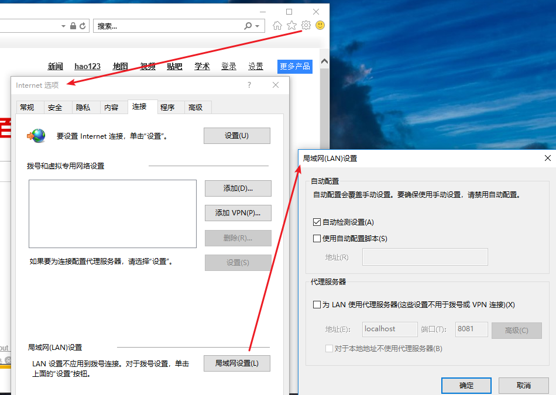

# WPAD

WPAD（web代理自动发现协议-Web Proxy Auto-Discovery Protocol），是客户端通过DHCP或DNS协议探测代理服务器配置脚本url的一种方式。当IE定位脚本并将脚本下载到本地之后，就可以通过该脚本来为不同的url选择相应的代理服务器。目前主流浏览器一般都支持WPAD。

## 正常WPAD流程

客户端希望访问wpad.dat配置文件以进行代理配置。 它搜索本地网络上名为“wpad”的计算机以查找此文件。 然后执行以下步骤：

1. 如果配置了DHCP服务器，则客户端从DHCP服务器检索wpad.dat文件（如果失败，则进行2，如果成功，则执行步骤4）

在打开第一个页面之前，向本地DHCP服务器发送DHCPINFORM query, 并使用返回的WPAD option中的URL.

2. 将pc.department.branch.example.com查询发送到DNS服务器以查找正在分发WPAD配置的设备。（如果成功，则采取步骤4）

`pc.department.branch.example.com`(计算机网络名称)

依次查找：

http://wpad.department.branch.example.com/wpad.dat

http://wpad.branch.example.com/wpad.dat

http://wpad.example.com/wpad.dat

<http://wpad.com/wpad.dat>(in incorrect implementations, see note in Security below)

3. 进行LLMNR/NetBIOS查询（如果成功，请转到步骤4，否则代理不能使用）

在windows下，如果DNS query查询不成功，则会进行此步骤。

4. 下载wpad.dat并使用

> 注意：

- 只在IPv4下s中行，IPv6中 WPAD-Option 无定义
- 不支持DHCP, 只支持DNS的浏览器有:Firefox, 非windows或ChromeOS的chrome, 版本不于13的Chrome

## 攻击流程

根据上述顺序，可以对第一步进行DHCP投毒攻击。 DNS投毒攻击自然可以执行第二步，但正如我在本文开头所指出的，配置的网络设备可以防止这些攻击。当通过LLMNR进行查询时，该请求将通过广播去到网络中的每个客户端。 在这一点上，攻击者将他的wpad.dat文件发送到客户端，就像wpad服务器。

重要的是WPAD协议是在Windows操作系统中内置的。 此配置可以在Internet Explorer浏览器的LAN设置部分中看到。

通过此配置，Internet Explorer在整个网络上进行WPAD名称解析查询

## 资料

wiki:

https://en.wikipedia.org/wiki/Web_Proxy_Auto-Discovery_Protocol

