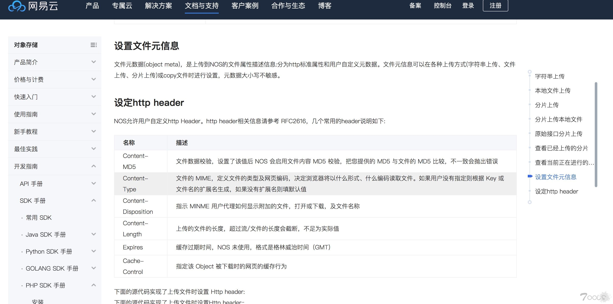

很多大网站上传图片后，展示出来的图片地址Response 里面 Content-Type 被强制 改成了 text/html ，也就是传的图片里面可以写js ，浏览器会解析。

这些被放了恶意图片的地址服务器全是 Server: openresty

## 案例

http://userphoto.bssdl.kugou.com/70296bbe6e02223af1cfb952b2eefcb3.jpg?qq-pf-to=pcqq.group#1519868991850

http://hi-163-common.nosdn.127.net/upload/201802/27/5c82eab01b9911e89ea15db8e67d329c

http://hi-163-common.nosdn.127.net/upload/201802/27/6efee9301baa11e89a72a5fc87cb5892

## 利用过程

测试地址：http://new.hi.163.com/#/setting/step1 。上传的时候，修改请求头里的content-type:text/plain，将其修改为text/html即可，访问上传头像获取的地址，发现原本的图片，已经把内容当做html进行渲染。

## 原理

NOS的文档中也有说明，header是可控的，所以用户可以直接更改content-type

## 解决方案

业务研发方：在使用对象存储时，根据业务需要在服务端先校验文件后缀类型，再校验Content-Type是否属与此后缀类型相匹配；

云储存方：文件后缀类型与文件MIME强关联，一一对应，例如禁止jpeg后缀的文件MIME变成text/html。

