# 一次过反爬虫的过五关斩六将

Author: ali0th

## 前言

码一下半年前的一次过反爬虫的经历，不知道这个反爬虫有没有改进了，主要还是看看思路吧:)

## 第一关：拿到javascript内容

一开始浏览器看不到反爬虫的js代码。

**难点：**

一开始打开这个网站，比较难留意到有个状态是521页面的跳转。因为这个页面一小时只出现一次，并且为1500毫秒。

**过关技巧：**

阻止cookie来获得javascript

**具体实现：**

删除cookie并阻止

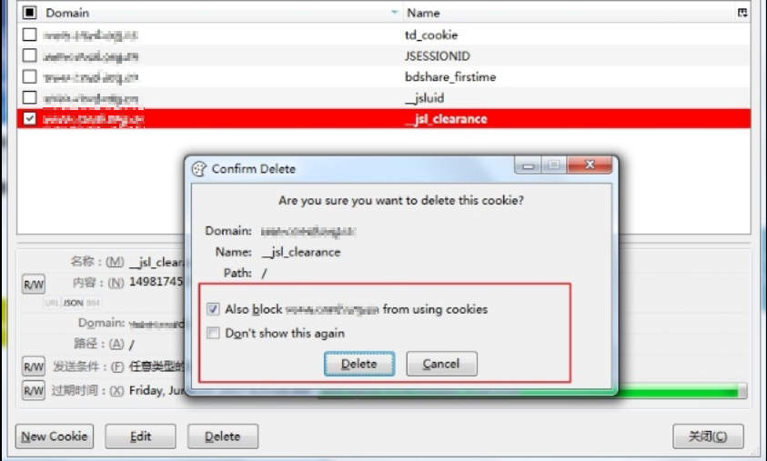

查看源码
 
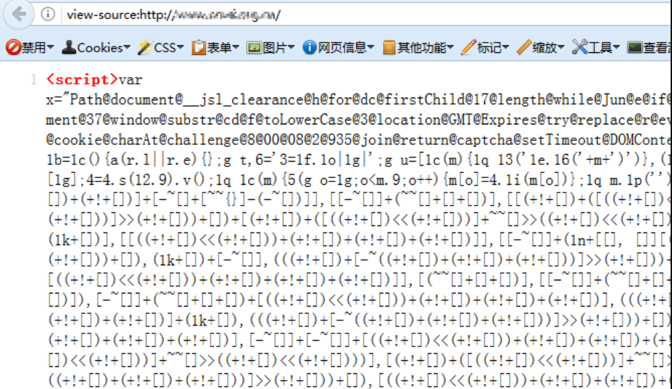

## 第二关：获得真实代码

**难点：**

将真正的代码隐藏起来，阻止了那些直接一上来就解码的人。

**过关技巧：**

找到最终输出点为eval

**具体实现：**

1）美化
使用【http://jsbeautifier.org/】

2）理解代码

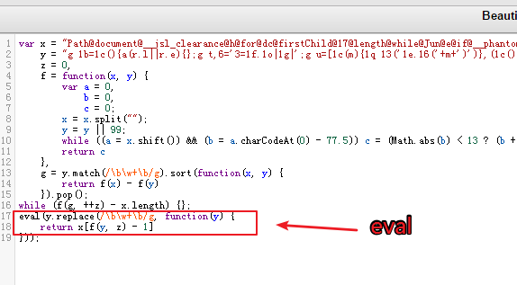

可以看到eval是最后一步，说明这里最后是通过eval来拼接并执行程序。所以这里可以把eval改为【console.log】放到F12的console口里看一下结果。

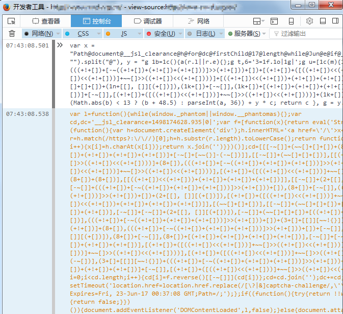

可以看到黄色部分为运行结果，说明是二次混淆了，这个黄色部分才是真实代码。复制出来看。如下：

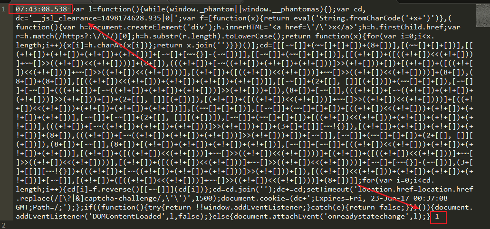

把头尾的东西去掉，没用的。再美化之后：

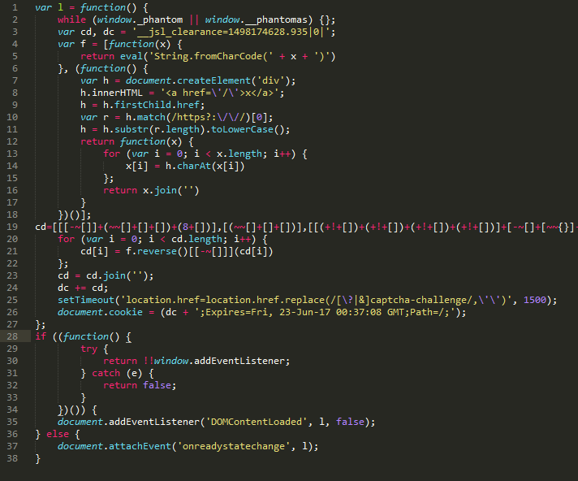

## 第三关：修正代码
**难点：**

如果你看到上面有个eval就使用第二关的方法，那就错了，这里的eval在代码中间，只是用来拼接用的。而且这里还有个故意留下的坑，就是让程序运行错误，所以这里要好好理解代码，弄懂其逻辑。

**过关技巧：**

放到IDE里梳理代码。(这里使用ecilpse)

**具体实现：**

1）代码贴到ecilpse里

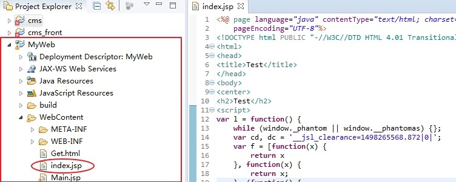

使用eclipse搭建一个js的测试页面，随时用浏览器刷新查看结果。

2）理清代码总体逻辑，并去掉不重要代码

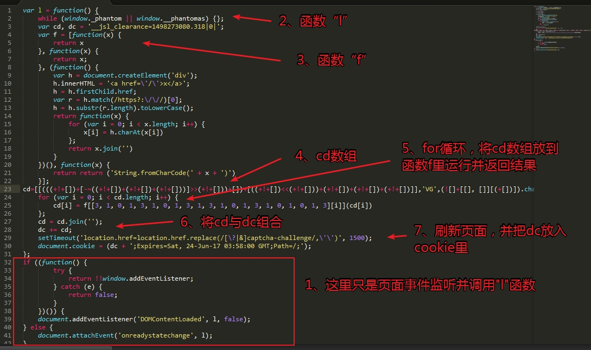

如图为整体代码的大逻辑，于是我们可以去掉不重要的代码，留下重要部分，放到eclipse里调试。

代码为：

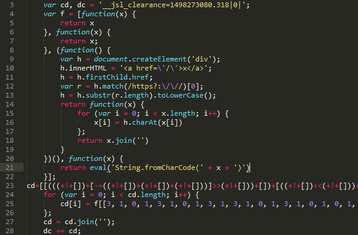

最后的dc即输出了我们要的结果。

3）输出dc出来

在最后写上一句【console.log(dc);】然后放到F12里：

看，这就是我们得到要的结果。
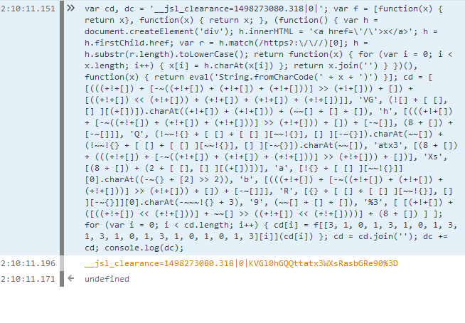

但是,放在python里，这样流程走下来的结果偶尔会对，偶尔又不行了。为什么呢？还要继续深挖。

## 第四关：jsfuck
**难点：**

特殊字符

**过关技巧：**

细心

**具体分析：**

cd数组，没错我们要搞cd数组。看起来应该是jsfuck，打CTF经常会遇到。但这里的话要怎么去分解他呢？看到这个地方：

再仔细看看：`f.reverse()[[-~[]]](cd[i])`其中，reverse()是逆序的意思，可以先去掉，就剩下：`f[[-~[]]](cd[i])`

这个的形式其实就是`f`，就是调用上面的f函数的形式，那么最奇怪的点就在这里`[ ]`里的`[-~[]]`，它是直接用的！
于是我试着直接看它是值是什么：

它直接就是值为1的数组。那么直接看cd的值试试：

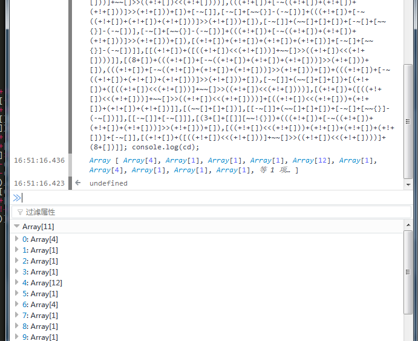

没错是一堆数组。用python看，里面是有几层数组：

为什么会这样呢？js的什么特性导致了？想了半天，想到了很多年前看到的一篇文章【http://www.freebuf.com/sectool/5352.html】：

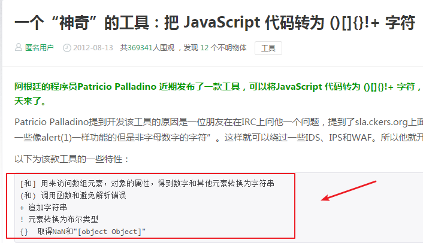

好了，过了这一关，基本上算是转折点，快接近终点了。

## 第五关：列表里的列表

**难点：**

f函数逻辑。

**过关技巧：**

看懂f函数逻辑，慢慢调试才知每部分的功能。

**具体分析：**

上一关我们看到数组里面还要数组，那么我们就要看各个数组对应的是什么值。
经过调试，发现最多出现三层数组。我们分别命令为x、y、z层。其中：

> x层直接为字符串，只要拼接就行了。
>
> y1层为ascii码。
>
> y2层和z层为对应当前url的第n个字符。这就是为什么上面第三关还不算成功的原因。

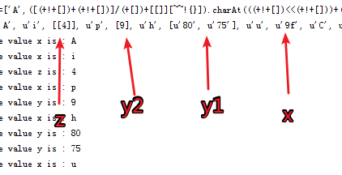

再具体说明一下z层，下面这个函数可以获得当前的页面的url，所以每个网站都不一样的。所以这一层个人认为是个相当棒的设计。

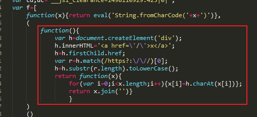

比如这里访问的是`http://localhost/`，那么先过滤出来`localhost/`，然后如果cd里这个z层数组值是4，那么得到的字符是`a`。所以最终，这个cd数组根据每一层的转换，就能变为：

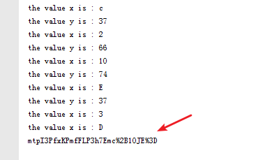

然后拼接dc就是最终我们要的结果了啦啦啦：

